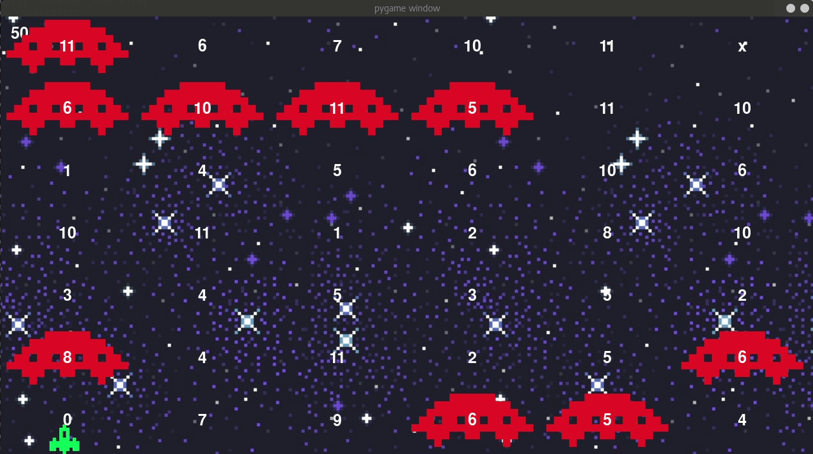

# Space Dijkstra

O Space Dijkstra é um space shooter onde atirar é apenas figurativo, pois o objetivo mesmo é chegar do outro lado do mapa sem que o seu conbustivel acabe.

Para andar em qualquer direção existe um custo de combustivel e se o seu combustivel acabar, bom o jogo acaba. Mas pelo menos existem postos para para abastecer no meio do caminho.

Você pode tentar se aventurar na viagem e tomar suas próprias escolhas, mas se quiser conhecer a melhor escolha é só perguntar para o Dijkstra. Aperte ```s``` e deixe a mágica acontecer

## Autores

| Nomde | github |
|:-----:|:------:|
| Cleber Júnior | [@cjjcastro](https://github.com/cjjcastro/) |
| Rômulo Vinícius de Souza | [@cjjcastro](https://github.com/romulosouza/) |

## Instalação

```
git clone https://github.com/projeto-de-algoritmos/lista2-space-dijkstra.git
cd lista2-space-dijkstra
pip3 install -r requirements.txt
```

obs: utilizamos para o desenvolvimento o python 3.5.3

## Rodar a aplicação

```
python3 game.py
```

## O jogo



## Utilizando Dijskstra


